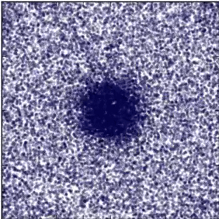

# Learn equations of motion
Can you automate a pipeline from particle-level simulations:  
   
to course-grained governing equations:  
?     

First, a gpu-accelerated simulation is performed with [hoomd-blue](http://glotzerlab.engin.umich.edu/hoomd-blue/).
The output of the simulation is then processed and fed into the methods layed out in [this interesting paper](http://advances.sciencemag.org/content/3/4/e1602614) in order to infer the governing PDEs. 

## See a properly rendered version of my jupyter notebook [here](https://nbviewer.jupyter.org/github/vsoni1/learn_equations_of_motion/blob/master/Diffusion.ipynb)
The notebook is aimed at learning the diffusion equation. Try reloading the page if it doesn't appear right the first time.
